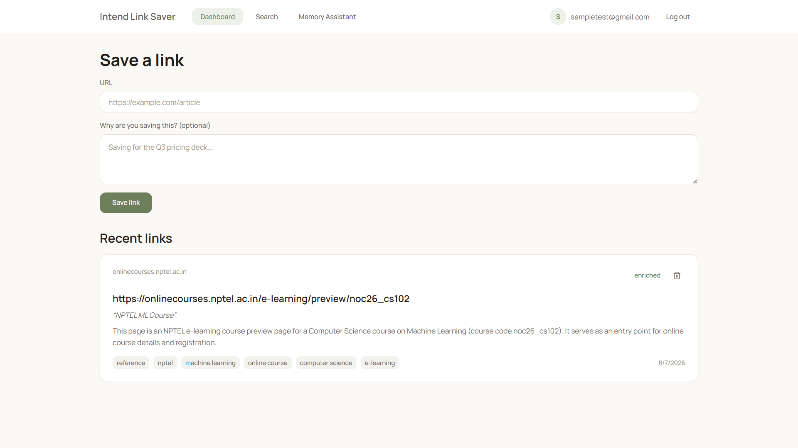
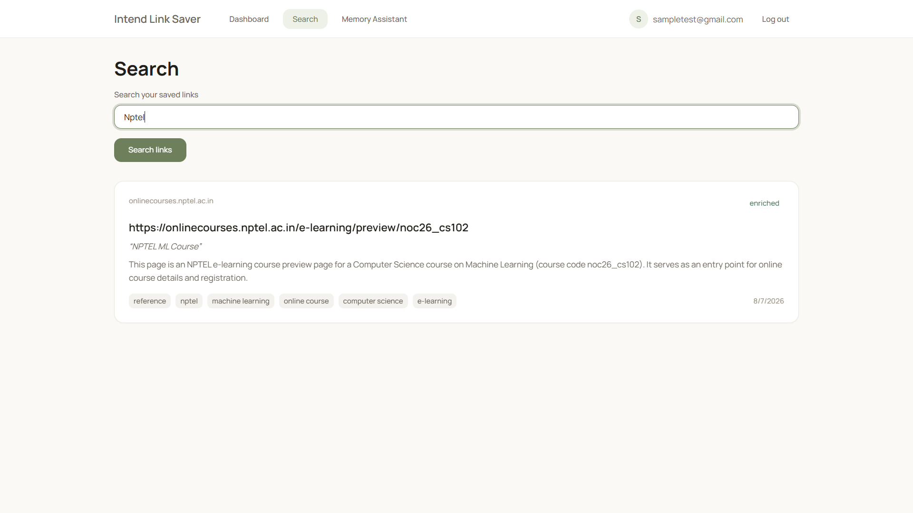
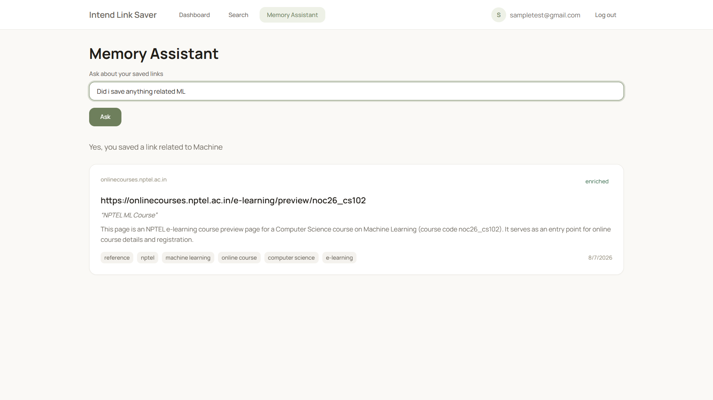

<div align="center">

# Intend Link Saver

### _An AI-Powered Knowledge Repository that Remembers **Why** You Saved Every Link._

<p align="center">

[]()
[]()
[]()
[]()
[]()
[]()
[]()
[]()

</p>

---

### **Save Links. Preserve Knowledge. Recall Intent.**

Traditional bookmark managers remember **where** something is.

**Intend Link Saver remembers why you saved it.**

Instead of collecting hundreds of forgotten bookmarks, Intend Link Saver transforms every saved URL into an AI-enriched piece of personal knowledge by automatically generating summaries, extracting key concepts, classifying intent, generating semantic embeddings, and allowing natural language retrieval months later.

</div>

---

# Project Overview

Intend Link Saver is an AI-powered personal knowledge repository designed to solve one of the biggest problems of modern internet usage:

> **People save information, but they forget why they saved it.**

Every day we bookmark tutorials, documentation, research papers, YouTube videos, blogs, GitHub repositories, and online courses.

After a few weeks our bookmarks become cluttered collections of URLs with little context.

Finding information becomes difficult because we rarely remember:

- the exact title
- the website
- the folder
- or even the keywords

We only remember the **intent**.

Examples include:

> "That Machine Learning course I wanted before placements."

> "The Docker article that explained networking."

> "The React optimization blog I planned to revisit."

Traditional bookmark managers cannot answer those questions.

Intend Link Saver can.

---

# Problem Statement

Conventional bookmarking applications are fundamentally storage systems.

They organize information using:

- folders
- labels
- manual tags
- dates
- alphabetical ordering

Unfortunately, human memory doesn't work that way.

People remember information semantically rather than structurally.

Instead of remembering:

```
Bookmarks
 └── AI
      └── Machine Learning
           └── NPTEL Course
```

users remember:

> "That course I saved before internship preparation."

Traditional search fails because the remembered phrase rarely matches the stored title.

As the number of bookmarks grows, retrieval becomes increasingly inefficient.

---

# Our Solution

Intend Link Saver combines Artificial Intelligence, Vector Embeddings, Semantic Search, and Natural Language Understanding to convert ordinary bookmarks into an intelligent knowledge repository.

Every saved link passes through an AI enrichment pipeline that:

- extracts webpage content
- understands the document
- summarizes important information
- identifies topics
- classifies intent
- generates vector embeddings
- stores everything inside PostgreSQL

Instead of searching for exact keywords, users search using natural language.

The application understands meaning rather than literal text.

---

# Key Features

## Secure Authentication

- JWT Authentication
- Protected Routes
- Password Hashing (bcrypt)
- User-specific data isolation
- Session persistence

---

## Smart Link Management

- Save URLs
- Personal Notes
- Automatic Metadata Extraction
- Ownership-based CRUD
- Pagination
- Filtering

---

## AI Enrichment Pipeline

Every saved link is automatically enriched using Google Gemini.

Generated information includes:

- AI Summary
- Intent Category
- Smart Tags
- AI Reason
- Semantic Embeddings

---

## Semantic Search

Unlike keyword search,

Semantic Search understands **meaning**.

Example queries:

```
Machine Learning course
```

```
React optimization article
```

```
Resources for interview preparation
```

Even if none of those exact words appear in the title, the correct resource can still be retrieved.

---

## Memory Assistant

Users can interact with their personal knowledge repository using natural language.

Example:

> What links have I saved about Machine Learning?

> Which article explained Docker networking?

> Show me resources related to AI interviews.

The assistant searches semantically before generating contextual answers based only on the user's saved knowledge.

---

## Graceful AI Failure Recovery

If AI enrichment fails:

- the bookmark is never lost
- user data remains intact
- enrichment can be retried later
- the application continues functioning normally

This ensures reliability even when external AI services are temporarily unavailable.

---

# Technology Stack

| Category           | Technologies                                        |
| ------------------ | --------------------------------------------------- |
| **Frontend**       | React, TypeScript, Vite, Tailwind CSS, Lucide React |
| **Backend**        | FastAPI, Python, SQLAlchemy                         |
| **Database**       | PostgreSQL, pgvector                                |
| **Authentication** | JWT, bcrypt                                         |
| **AI**             | Google Gemini 2.5 Flash                             |
| **Embeddings**     | Gemini Embedding-001                                |
| **Search**         | Vector Similarity Search (Cosine Similarity)        |
| **DevOps**         | Docker, Docker Compose                              |
| **Migrations**     | Alembic                                             |

---

# Highlights

- AI-Powered Bookmark Manager
- Semantic Search
- Personal Memory Assistant
- Vector Database Integration
- Dockerized Full Stack Architecture
- RESTful FastAPI Backend
- Responsive React Frontend
- Google Gemini Integration
- PostgreSQL + pgvector
- JWT Authentication
- Production-ready Project Structure

---

# System Architecture

The project follows a modular full-stack architecture where every layer has a single responsibility.

```
                                    USER
                                      │
                                      ▼
                         React + TypeScript Frontend
                                      │
                           REST API Communication
                                      │
                                      ▼
                           FastAPI Backend Services
                                      │
          ┌───────────────────────────┼───────────────────────────┐
          │                           │                           │
          ▼                           ▼                           ▼
 Authentication Service        Link Management          Search Service
          │                           │                           │
          └───────────────┬───────────┴───────────────┬───────────┘
                          ▼                           ▼
                 AI Enrichment Service       Memory Assistant
                          │                           │
                          └──────────────┬────────────┘
                                         ▼
                                 Google Gemini API
                              (Generation + Embeddings)
                                         │
                                         ▼
                           PostgreSQL + pgvector Database
```

---

# Project Workflow

The complete lifecycle of a saved resource follows a structured AI pipeline.

```
User Pastes URL
        │
        ▼
Save Link
        │
        ▼
Store Initial Record
(Status = READY)
        │
        ▼
Fetch Webpage Content
        │
        ▼
Readable Text Extraction
        │
        ▼
Google Gemini
        │
        ├──────────────┐
        │              │
        ▼              ▼
Generate Summary    Generate Tags
        │              │
        └──────┬───────┘
               ▼
Intent Classification
               │
               ▼
Generate Embeddings
               │
               ▼
Store AI Data
(Status = ENRICHED)
               │
               ▼
Ready for Search &
Memory Assistant
```

---

# Application Modules

The application is divided into independent modules where each module performs a single well-defined responsibility.

| Module           | Responsibility                                        |
| ---------------- | ----------------------------------------------------- |
| Authentication   | User Registration, Login, JWT Session Management      |
| Link Management  | Store, Update, Delete and Retrieve Links              |
| AI Enrichment    | Generate Summary, Tags, Intent Category and AI Reason |
| Embedding Engine | Generate Semantic Embeddings using Gemini             |
| Semantic Search  | Vector Similarity Search using pgvector               |
| Memory Assistant | Natural Language Question Answering                   |
| Database Layer   | Persistent Storage                                    |
| Frontend         | User Interface & API Integration                      |

---

# Authentication Flow

Authentication is implemented using JWT (JSON Web Tokens).

```
Register
     │
     ▼
Password Hashing (bcrypt)
     │
     ▼
Store User
     │
     ▼
Login
     │
     ▼
Verify Password
     │
     ▼
Generate JWT
     │
     ▼
Store Token
(Local Storage)
     │
     ▼
Authenticated Requests
```

Every protected API validates the JWT before processing the request, ensuring complete user isolation.

---

# AI Enrichment Pipeline

The enrichment pipeline is the core intelligence layer of the project.

Unlike conventional bookmark managers that only save URLs, Intend Link Saver understands the actual content behind every link.

The enrichment process performs the following operations sequentially:

### Step 1 — Content Fetching

The application downloads the webpage content and extracts clean readable text.

---

### Step 2 — AI Understanding

Google Gemini analyzes the extracted document and generates:

- AI Summary
- AI Tags
- Intent Category
- AI Reason (when user note is unavailable)

---

### Step 3 — Embedding Generation

The processed information is converted into dense vector embeddings.

These vectors capture the semantic meaning of the document instead of simply storing keywords.

---

### Step 4 — Database Storage

The following information is permanently stored:

- Original URL
- Title
- User Note
- AI Summary
- AI Reason
- Tags
- Intent Category
- Embedding Vector
- Enrichment Status

---

# Semantic Search Workflow

Traditional Search

```
Query
     │
Keyword Match
     │
Results
```

Semantic Search

```
User Query
      │
Generate Query Embedding
      │
      ▼
Cosine Similarity
(pgvector)
      │
      ▼
Rank Similar Documents
      │
      ▼
Return Best Matches
```

Instead of matching words, the application compares vector representations, allowing users to search using meaning rather than exact text.

---

# Memory Assistant Workflow

The Memory Assistant combines semantic retrieval with generative AI.

```
User Question
       │
       ▼
Generate Query Embedding
       │
       ▼
Semantic Search
       │
Retrieve Top Links
       │
       ▼
Send Context to Gemini
       │
       ▼
Generate Final Answer
       │
       ▼
Display Answer +
Referenced Links
```

This Retrieval-Augmented Generation (RAG) workflow ensures responses are grounded in the user's own saved knowledge instead of relying on generic AI responses.

---

# Database Design

The database is built on PostgreSQL with pgvector support.

### Core Entities

### User

Stores registered users and authentication information.

---

### Link

Stores:

- URL
- Title
- User Notes
- AI Summary
- AI Reason
- Intent Category
- Embedding Vector
- Processing Status

---

### Tag

Stores reusable tags generated manually or by AI.

---

### LinkTag

Many-to-many relationship connecting Links and Tags.

---

# REST API Overview

## Authentication

| Method | Endpoint         | Description   |
| ------ | ---------------- | ------------- |
| POST   | `/auth/register` | Register User |
| POST   | `/auth/login`    | User Login    |
| POST   | `/auth/logout`   | Logout        |
| GET    | `/auth/me`       | Current User  |

---

## Links

| Method | Endpoint             |
| ------ | -------------------- |
| POST   | `/links`             |
| GET    | `/links`             |
| GET    | `/links/{id}`        |
| PATCH  | `/links/{id}`        |
| DELETE | `/links/{id}`        |
| POST   | `/links/{id}/enrich` |

---

## Search

| Method | Endpoint      |
| ------ | ------------- |
| GET    | `/search`     |
| POST   | `/search/ask` |

---

# Folder Structure

```text
intend-link-saver/

backend/
│
├── app/
│   ├── routers/
│   ├── services/
│   ├── models/
│   ├── schemas/
│   ├── prompts/
│   ├── dependencies.py
│   ├── db.py
│   └── main.py
│
├── alembic/
└── tests/

frontend/
│
├── src/
│   ├── api/
│   ├── app/
│   ├── components/
│   ├── design/
│   ├── features/
│   └── pages/

docker-compose.yml
README.md
```

---

# Installation Guide

## Prerequisites

Before running the project, ensure the following software is installed.

| Software       | Version |
| -------------- | ------- |
| Python         | 3.12+   |
| Node.js        | 20+     |
| PostgreSQL     | 16+     |
| Docker         | Latest  |
| Docker Compose | Latest  |
| Git            | Latest  |

---

# Clone Repository

```bash
git clone https://github.com/<your-username>/intend-link-saver.git

cd intend-link-saver
```

---

# Environment Variables

Create the following file:

```
backend/.env
```

```env
APP_NAME="Intend Link Saver"

ENVIRONMENT=development

DATABASE_URL=postgresql+psycopg://postgres:postgres@db:5432/intend_link_saver

JWT_SECRET=your-secret-key

GEMINI_API_KEY=your-gemini-api-key

CORS_ORIGINS=["http://localhost:5173"]
```

---

# Running with Docker (Recommended)

Build the application

```bash
docker compose up --build
```

Run in detached mode

```bash
docker compose up -d
```

Stop containers

```bash
docker compose down
```

View logs

```bash
docker compose logs -f
```

---

# Local Development

## Backend

```bash
cd backend

python -m venv .venv

source .venv/bin/activate

pip install -r requirements.txt

uvicorn app.main:app --reload
```

---

## Frontend

```bash
cd frontend

npm install

npm run dev
```

---

# Application URLs

| Service      | URL                                |
| ------------ | ---------------------------------- |
| Frontend     | http://localhost:5173              |
| Backend      | http://localhost:8000              |
| Swagger UI   | http://localhost:8000/docs         |
| OpenAPI JSON | http://localhost:8000/openapi.json |

---

# Docker Architecture

```
                    Docker Compose

        ┌────────────────────────────────────┐
        │                                    │
        │        Frontend Container          │
        │     React + Vite + TypeScript      │
        │                                    │
        └───────────────┬────────────────────┘
                        │
                        ▼
        ┌────────────────────────────────────┐
        │                                    │
        │        Backend Container           │
        │      FastAPI + Gemini + JWT        │
        │                                    │
        └───────────────┬────────────────────┘
                        │
                        ▼
        ┌────────────────────────────────────┐
        │                                    │
        │ PostgreSQL + pgvector Container    │
        │                                    │
        └────────────────────────────────────┘
```

---

# Testing

Backend

```bash
pytest
```

Frontend

```bash
npm test
```

Production Build

```bash
npm run build
```

---

# Demonstration Workflow

### User Registration

```
Register

↓

JWT Authentication

↓

Login Successful
```

---

### Saving Knowledge

```
Paste URL

↓

Save Link

↓

AI Enrichment

↓

Generate Summary

↓

Generate Tags

↓

Generate Embeddings

↓

Store in PostgreSQL
```

---

### Semantic Retrieval

```
Ask Question

↓

Generate Query Embedding

↓

Vector Similarity Search

↓

Retrieve Best Links

↓

Generate AI Response
```

---

# Project Highlights

✔ AI Powered Bookmark Manager

✔ Google Gemini Integration

✔ Semantic Search using Vector Embeddings

✔ Memory Assistant

✔ JWT Authentication

✔ FastAPI REST API

✔ PostgreSQL + pgvector

✔ Dockerized Architecture

✔ Modular Backend Design

✔ Responsive React Frontend

✔ Clean Component Architecture

✔ Production Ready Project Structure

---

# Application Showcase

## Dashboard

<p align="center">
  
</p>

The dashboard serves as the central workspace where users can save, organize, and manage their personal knowledge base. Every bookmarked link is displayed with its enrichment status, extracted metadata, and quick actions for deletion or further AI processing.

---

## AI Enrichment

<p align="center">
  
</p>

Once a link is saved, Google Gemini analyzes its content to automatically generate a concise summary, classify the resource, identify relevant tags, and extract meaningful context. This transforms ordinary bookmarks into structured, searchable knowledge.

---

## Semantic Search

<p align="center">
  
</p>

Instead of relying solely on exact keyword matches, semantic search retrieves links based on meaning and context using vector embeddings. Users can search naturally and quickly rediscover previously saved resources.

---

## Memory Assistant

<p align="center">
  
</p>

The Memory Assistant enables conversational interaction with the user's saved knowledge base. Users can ask natural-language questions, and the assistant retrieves the most relevant links along with AI-generated context, making previously stored information easy to recall.

---

# Performance Characteristics

| Feature           | Implementation         |
| ----------------- | ---------------------- |
| Authentication    | JWT                    |
| Password Security | bcrypt                 |
| AI Processing     | Google Gemini          |
| Embeddings        | Gemini Embedding Model |
| Search            | Cosine Similarity      |
| Database          | PostgreSQL + pgvector  |
| API Style         | REST                   |
| Containerization  | Docker                 |

---

# Future Enhancements

Although the current implementation satisfies the intended project scope, several enhancements can further improve usability.

- Browser Extension
- Chrome Bookmark Import
- Firefox Bookmark Import
- Mobile Application
- AI Folder Suggestions
- Shared Collections
- Team Workspaces
- PDF & Document Support
- Voice Search
- OCR Support
- Calendar Integration
- Knowledge Graph Visualization
- Multi-language Search
- AI Recommendation Engine
- Offline Embedding Support

---

# Learning Outcomes

Through this project, the following concepts were explored and implemented:

- Full Stack Application Development
- REST API Design
- Authentication using JWT
- PostgreSQL Database Design
- SQLAlchemy ORM
- Alembic Database Migrations
- Docker Containerization
- AI Integration
- Prompt Engineering
- Semantic Search
- Vector Databases
- Retrieval-Augmented Generation (RAG)
- React State Management
- TypeScript Development
- Modern UI Design

---

# Author

**Riya Dodiya**

---
